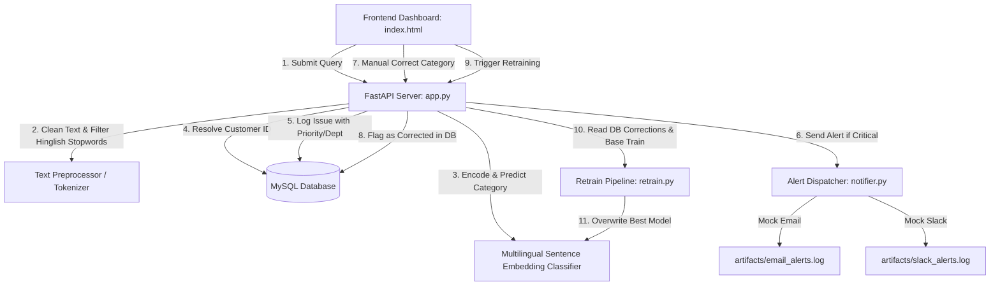

# Customer Ticket Intelligent Routing & Classification System

An end-to-end, production-grade support ticket classification and routing system. It automatically classifies customer queries into five categories (**Payment Issue**, **Technical Problem**, **Product Inquiry**, **Refund Request**, and **Delivery Issue**), links queries to customer profiles in a persistent MySQL database, dispatches real-time alerts for critical issues, and integrates a manual correction-backed active learning retraining loop.

---

## 🏗️ Architecture & Data Flow



---

## 🛠️ Technology Stack

- **Machine Learning & NLP**:
  - PyTorch & Sentence-Transformers (`paraphrase-multilingual-MiniLM-L12-v2`)
  - Scikit-Learn (Naive Bayes, Logistic Regression, LabelEncoder, Pipelines)
  - XGBoost Classifier
  - MLflow (Experiment tracking and lifecycle management)
- **Web Application & API**:
  - FastAPI (Python backend)
  - Uvicorn (ASGI web server)
  - Vanilla HTML, CSS, JavaScript (Interactive dashboard UI)
- **Database**:
  - MySQL (PyMySQL client connector)
- **Package Management**:
  - `uv` (Fast package manager)

---

## 🌟 Key Features

1. **Native Hinglish Support**: Clean, custom Hinglish stopwords filtering paired with a pre-trained multilingual embedding model. It captures semantic intent (e.g., mapping colloquial Hindi/Hinglish *"meraa card double charge ho gaya"* to **Refund Request** with >96% confidence) without external translation APIs.
2. **Priority & Department Routing**: Automatically routes tickets to their corresponding departments (e.g., *IT Support*, *Finance & Billing*) and assigns priority levels based on text keyword heuristics.
3. **Persisted Issue Database**: Integrates customer lookup and logs every incoming ticket, tracking historical confidence, priority, and override status.
4. **Active Learning Retraining Loop**: Support agents can manually correct predictions in the UI. Retraining queries the database for corrections, merges them with the base training data, and updates the production model.
5. **Robust Optimization**: Employs custom PyTorch DLL loader fixes for Windows systems and overrides serialization methods to keep the final model file footprint under 10KB.

---

## 🚀 Setup & Installation

### 1. Prerequisites
- Python 3.12+
- MySQL Server (running and accessible)
- `uv` installed (install via `pip install uv` or `cargo install uv`)

### 2. Environment Configuration
Create a `.env` file in the root directory:
```env
DB_HOST=127.0.0.1
DB_PORT=3306
DB_USER=root
DB_PASSWORD=your_mysql_password
DB_NAME=customers_db
```

### 3. Install Dependencies
Initialize virtual environment and install requirements:
```bash
uv venv
# On Windows:
.venv\Scripts\activate
# On macOS/Linux:
source .venv/bin/activate

uv pip install -r requirements.txt
```

### 4. Initialize Database
Create tables and populate with mock customers:
```bash
uv run setup_db.py
```

### 5. Train Models & Persist Best Model
Run the pipeline to train, tune hyperparameters, evaluate, and save the best model:
```bash
uv run src/train.py
```

### 6. Run the FastAPI Web Server
Start the Uvicorn ASGI server:
```bash
uv run uvicorn api.app:app --host 127.0.0.1 --port 8000
```
Open **[http://127.0.0.1:8000/](http://127.0.0.1:8000/)** in your web browser to access the dashboard.

---

## 🧪 Unit Testing

To verify the NLP cleaner, model loading, and training integrations, run:
```bash
uv run tests/test_pipeline.py
```

---

## 📈 Evaluation Performance Summary

We compared all four models on the **Bitext Customer Support Dataset** (16,016 training rows, 3,432 validation rows, and 3,432 test rows):

| Model Name | Feature Extraction | CV F1 Score (Weighted) | Test F1 Score (Weighted) | Test Accuracy |
| :--- | :--- | :---: | :---: | :---: |
| **`embedding` (Active Model)** | **Multilingual Dense Embeddings** | **99.68%** | **99.74%** | **99.74%** |
| `naive_bayes` | TF-IDF (1, 2) ngrams | 99.51% | 99.62% | 99.62% |
| `lstm` | Word Sequence (RNN) | 99.08% | 99.42% | 99.42% |
| `xgboost` | TF-IDF (1, 2) ngrams | 99.22% | 98.22% | 98.22% |
