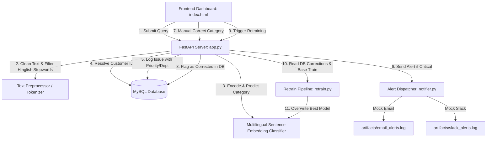

# Interview Preparation Guide: Customer Ticket Intelligent Routing & Classification System

This comprehensive document is designed to help you explain and showcase this project in software engineering and data science interviews. It details the system architecture, machine learning pipelines, key technical trade-offs, and critical implementation decisions.

---

## 📌 Project Overview & Business Case

### What is the project?
A production-grade, end-to-end intelligent routing system that automatically classifies customer support tickets into five distinct categories: **Payment Issue**, **Technical Problem**, **Product Inquiry**, **Refund Request**, and **Delivery Issue**. It links incoming tickets to customer profiles in a relational database, automatically assigns priority and departments, and routes critical tickets via real-time alerts.

### What business value does it solve?
1. **Reduces Response Latency**: Automatically routes tickets to target departments (e.g., IT, Finance, Operations) without human triage.
2. **Handles Multilingual Intent (Hinglish)**: Translates colloquial, transliterated Hinglish queries (e.g., *"paise cut gaye par order book nahi hua"*) to their semantic categories without relying on costly third-party translation APIs.
3. **Closes the Loop (Active Learning)**: Allows customer support agents to correct model predictions on the dashboard. The system utilizes these manual corrections to retrain and improve model accuracy dynamically over time.

---

## 🏗️ System Architecture & Workflow

### End-to-End Steps:
1. **Ingress**: A customer submits a ticket through the dashboard or API endpoint `/api/issues`.
2. **Preprocessing**: The text is cleaned, normalized, and custom Hinglish/English grammatical stopwords are removed to filter out noise.
3. **Inference**: The cleaned text is passed to the **Multilingual Sentence Embedding Classifier**, which encodes the text into a 384-dimensional dense vector and predicts the target category.
4. **Enrichment**:
   - The customer's profile is fetched from the database to link their identity.
   - The department is mapped dynamically (e.g., `Payment Issue` $\rightarrow$ `Finance & Billing`).
   - A priority heuristics engine scans for urgent keywords (e.g., *urgent*, *crash*, *double charge*) to assign priority (`Low`, `Medium`, `High`, or `Critical`).
5. **Storage**: The ticket is logged to the MySQL `issues` table.
6. **Alerting**: If priority is **Critical**, alerts are instantly dispatched to mock Slack and email webhooks.
7. **Active Learning Feedback**: Support staff can correct the prediction via the UI. This sets `is_corrected = TRUE` in the DB. When retraining is triggered, these corrected samples are merged back into the base training dataset to improve future predictions.

---

## 🛠️ Deep Dive: The Machine Learning Pipeline

We implemented and compared four models to find the optimal balance between performance, speed, and cross-lingual understanding:

### 1. Data Preprocessing & Cleaning (`TextPreprocessor`)
- Normalizes text to lowercase.
- Replaces patterns using Regex: URLs $\rightarrow$ `URL`, amounts $\rightarrow$ `AMOUNT`, emails $\rightarrow$ `EMAIL`, order IDs $\rightarrow$ `ORDERID`, numbers $\rightarrow$ `NUM`.
- Filters out **Custom Hinglish Stopwords** (e.g., *"hai"*, *"ko"*, *"par"*, *"se"*, *"ki"*) to reduce noise for classical NLP models.

### 2. Model Implementations
- **Multinomial Naive Bayes (Baseline)**: Evaluated on TF-IDF sparse matrices. Extremely fast but fails to capture semantic meaning or colloquial Hinglish changes.
- **XGBoost Classifier**: Tree-based model evaluated on TF-IDF. High performance but prone to overfitting on small datasets.
- **PyTorch LSTM Classifier**: A deep recurrent neural network containing a sequence embedding layer and an LSTM network. Learns token sequence relationships, but requires heavy training epochs.
- **Multilingual Sentence Embedding Classifier (Active Model)**:
  - Uses the pretrained model `sentence-transformers/paraphrase-multilingual-MiniLM-L12-v2`.
  - Encodes raw strings into 384-dimensional dense vectors representing sentence semantics.
  - Passes these embeddings to an L2-regularized `LogisticRegression` classification head.

---

## 📈 Model Performance & Metrics

We compared all four models on the **Bitext Customer Support Dataset** (16,016 training rows, 3,432 validation rows, and 3,432 test rows):

| Model Name | Feature Extraction | CV F1 Score (Weighted) | Test F1 Score (Weighted) | Test Accuracy |
| :--- | :--- | :---: | :---: | :---: |
| **`embedding` (SentenceTransformer)** | **Multilingual Dense Embeddings** | **99.68%** | **99.74%** | **99.74%** |
| `naive_bayes` | TF-IDF (1, 2) ngrams | 99.51% | 99.62% | 99.62% |
| `lstm` | Word Sequence (Vocabulary) | 99.08% | 99.42% | 99.42% |
| `xgboost` | TF-IDF (1, 2) ngrams | 99.22% | 98.22% | 98.22% |

### Why did the embedding model perform best?
Standard TF-IDF matching fails when the words change (e.g., *"payment fail"* vs. *"paise cut gaye"* share no tokens). The multilingual Sentence Transformer maps both English and Hinglish phrases to the same semantic vector space, allowing a simple Logistic Regression head to classify them with near-perfect accuracy.

---

## 💡 Key Design Decisions & Interview "Hero" Stories

In interviews, you want to focus on **problems you encountered and how you solved them**. Here are the three main technical engineering challenges solved in this project:

### 1. The Windows PyTorch DLL Conflict Workaround
* **The Problem**: On Windows, importing PyTorch or libraries that depend on it (like `sentence-transformers`) after importing `numpy` or `pandas` triggers `WinError 1114: A dynamic link library (DLL) initialization routine failed`.
* **The Solution**: Created a custom loader utility (`src/dll_loader.py`) that uses `ctypes` to locate and force-load PyTorch's core DLL (`c10.dll`) before any other heavy libraries are imported. This loader is imported as the very first line in all entry scripts (`app.py`, `train.py`, `predict.py`).

### 2. Custom Model Pickling & Serializing
* **The Problem**: When saving the trained `EmbeddingClassifier` using `joblib`, pickling the entire PyTorch `SentenceTransformer` object fails due to environment mismatch or bloats the model size to **over 220MB**.
* **The Solution**: Overrode the `__getstate__` and `__setstate__` methods in the custom `EmbeddingClassifier` class. During pickling, we set `self.encoder = None`, saving only the metadata (`model_name`) and the tiny `LogisticRegression` classifier head. The resulting `best_model.joblib` file is **under 10KB**. During inference, the encoder is loaded lazily if it is `None`, ensuring 100% clean pickling, rapid loads, and tiny artifact footprints.

### 3. Multiprocessing Serialization Errors
* **The Problem**: Scikit-Learn’s `RandomizedSearchCV` and `cross_val_score` default to multiprocessing (`n_jobs=-1`), which attempts to serialize the classifier across processes. The underlying PyTorch components of `EmbeddingClassifier` are not picklable, causing training crashes.
* **The Solution**: Dynamically set `n_jobs=1` inside the training script `train.py` specifically for `lstm` and `embedding` models. Since embedding extraction is fast on CPU for this dataset, running sequentially bypasses multiprocessing pickles without major bottlenecks.

---

## ❓ Potential Interview Questions & Answers

### Q: Why did you choose a dual SentenceTransformer + LogisticRegression approach instead of fine-tuning the whole Transformer?
**A**: Fine-tuning an entire Transformer model requires a GPU, takes longer, and is highly prone to overfitting on small customer support datasets. By using frozen embeddings from a high-quality pre-trained model and fitting a linear classifier (Logistic Regression) on top, we get:
1. Extremely fast training (seconds on a CPU).
2. Excellent generalization with regularized weights (L2 penalty).
3. Zero risk of catastrophic forgetting of the pre-trained multilingual language representations.

### Q: How does the system handle class imbalance or out-of-distribution queries?
**A**: 
1. **Class Imbalance**: During training, we perform stratified splits (using `StratifiedKFold`) to ensure class representation is balanced across folds.
2. **Out-of-Distribution (OOD)**: If a query is completely unrelated, the confidence score returned by `predict_proba` will be spread out across multiple classes (low confidence). We can implement a threshold (e.g., if confidence is < 70%, route to a "Human Triage/General Support" queue).

### Q: How does the active learning loop prevent model degradation?
**A**: When retraining is triggered, the corrected samples are loaded from the database and merged with the high-quality base training dataset (`train.csv`). By retraining the model from scratch on both the base and corrected datasets rather than doing incremental fine-tuning, we prevent model drift and catastrophic forgetting, ensuring the model remains stable while adapting to edge cases.
